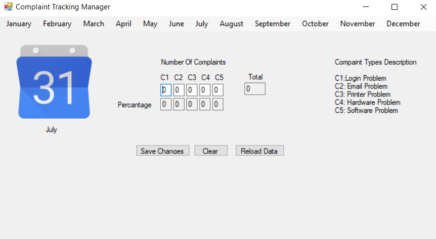

# ComplaintTrackingManager

-ENG- 

Complaint Tracking Manager is an application prepared with .Net framework. It records problem types monthly and shows problemrates. Thanks to the application, it is possible to record problem types and rates on a monthly basis.

-TR-
 
Şikayet Takip Yöneticisi .Net çerçevesi ile hazırlanmış bir uygulamadır. Aylık olarak problem tiplerini kaydeder ve problem oranlarını gösterir. Uygulama sayesinde aylık olarak sorun türleri ve oranları kayıt altına alınabilmektedir.

